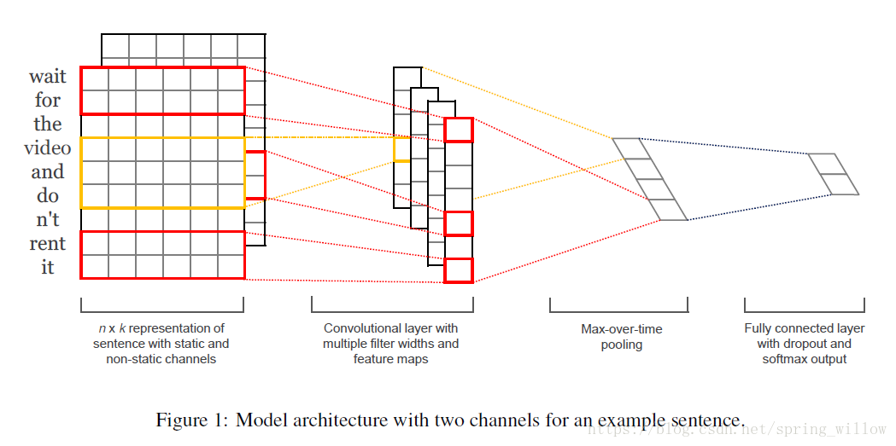

# CNN文本分类
使用cnn进行文本分类

## 介绍
本项目流程为

* 文本分词，计算词典
* 使用Embeding计算词向量
* 使用CNN提取词特征
* 使用Linear进行分类

## 环境
```
conda create -n zh python=3.9
conda activate zh
python -m pip install --upgrade pip
pip install -r requirements.txt
```

## 运行
* 计算词典并保存

`python run.py --w2v`

* 模型训练

`python run.py --train`

*本README.md中模型图来自* [这里](https://blog.csdn.net/spring_willow/article/details/80011161)
若侵权请联系我删除。